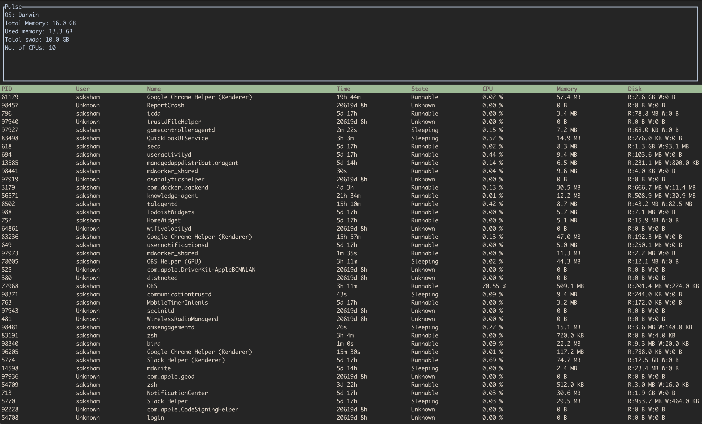

# Pulse 

A lightweight, real-time system monitor built with Rust and Ratatui.



Pulse provides a clear and interactive view of your system's processes and resource usage directly in your terminal.

## Features (Current)

- **Real-time Process List:** Monitors all active processes with PID, Name, and Disk Usage.
- **Interactive Navigation:** 
  - `Up/Down Arrows`: Scroll through the process list.
  - `q`: Quit the application.
- **Auto-Refresh:** System data updates dynamically every 200ms.
- **Responsive Layout:** Split view with a dedicated header for system information and a main table for process management.
- **Modern Terminal UI:** Built using Ratatui with thick borders and custom highlights.

## Getting Started

### Prerequisites

- [Rust](https://www.rust-lang.org/tools/install) (latest stable version)
- A terminal with support for raw mode (standard on Linux, macOS, and modern Windows terminals)

### Running the Application

Clone the repository and run using Cargo:

```bash
# Clone the repository
git clone <your-repo-url>
cd pulse

# Run in release mode for best performance
cargo run --release
```

## 🛠️ Built With
- **[Ratatui](https://github.com/ratatui-org/ratatui):** For the terminal user interface.
- **[sysinfo](https://github.com/GuillaumeGomez/sysinfo):** To fetch system and process information.
- **[Crossterm](https://github.com/crossterm-rs/crossterm):** For terminal handling and events.
